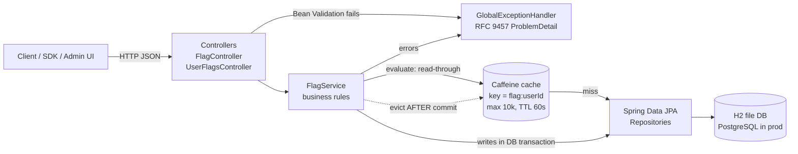
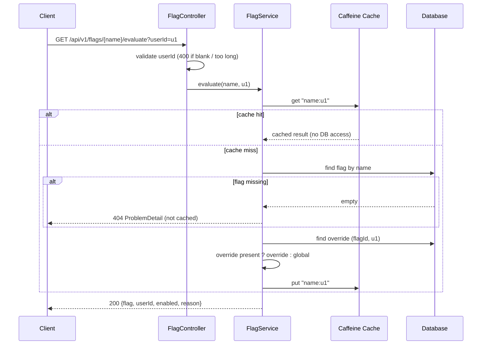
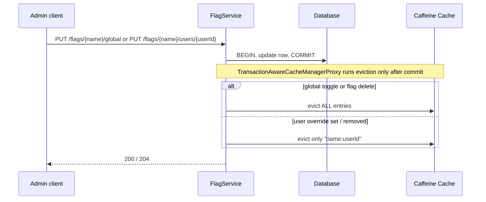

# Architecture

## High-level component view

## Evaluate request lifecycle

## Write path and cache invalidation

## Key decisions

| Decision | Why | Trade-off |
|---|---|---|
| Precedence: user override > global | Simple, predictable rule for targeting | No segments / percentage rollout yet |
| Cache evaluation results, key `flag:userId` | Evaluation is the hot read path | Many keys per flag |
| Evict all on global change | Always correct, simple | Brief cache miss spike after global toggles |
| Evict after commit | Prevents concurrent reads re-caching stale data | Needs transaction-aware cache manager |
| 60s TTL | Safety net if an eviction is missed | Up to 60s staleness in worst case |
| Local Caffeine cache | Fast, zero infra | Not shared across instances; use Redis or pub/sub invalidation when scaling out |
| `@Version` optimistic locking | Concurrent updates return 409 instead of silently overwriting | Client must retry |
| Unique (flag_id, user_id) + index | One override per user, O(log n) lookup | None significant |
